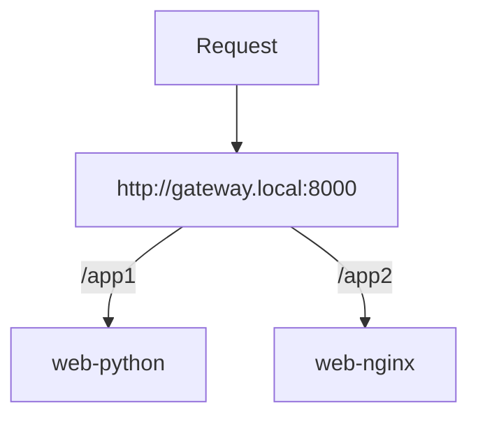
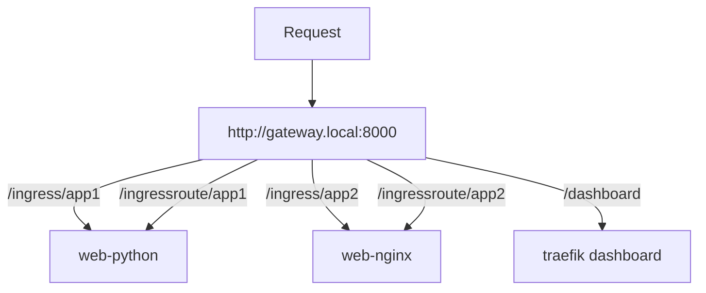
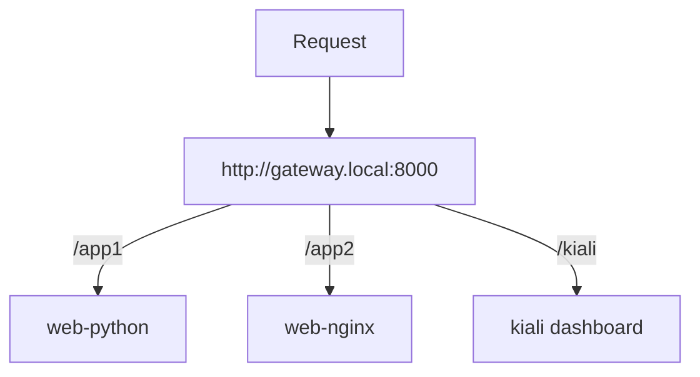

# API Gateway Lab

This repo contains a number of helm charts to experiment with kubernetes API
Gateway and Ingress approaches.

[Traefik](https://doc.traefik.io/traefik/) and [Istio](https://istio.io/latest/)
will be evaluated. Each of the charts deploy two web servers which are routed to
based on match rules in the gateway configuration.



**Table of Contents**

- [Setup](#setup)
- [Traefik](#traefik)
- [Istio](#istio)
- [Takeaways](#takeaways)

## Setup

Install [Docker](https://docs.docker.com/get-docker/),
[kind](https://kind.sigs.k8s.io/), and
[Helm](https://helm.sh/docs/intro/install/) in order to run the local kubernetes
cluster.

All of the examples require the `gateway.local` domain to point to localhost.
The setup script will add an entry for this to the `/etc/hosts` file
automatically (will require a sudo password).

To set everything up run the following command.

```bash
make setup
```

This script will

- Add `gateway.local` to `/etc/hosts` (will require a sudo password).
- Create a new cluster using kind.
- Install all of the helm chart dependencies.

The cluster will use port 8000 on the host.

## Traefik

To install the traefik chart run the following.

```bash
make traefik
```

Traefik supports defining routes via the standard kubernetes [Ingress][t1]
class, the [Gateway API][t2] standard, as well as its own [IngressRoute][t3]
CRD. The traefik demo chart deploys a set of routes for each supported approach.

Traefik comes with its own dashboard for viewing and analyzing the currently
deployed configuration.



- http://gateway.local:8000/ingress/app1
- http://gateway.local:8000/ingress/app2
- http://gateway.local:8000/ingressroute/app1
- http://gateway.local:8000/ingressroute/app2
- http://gateway.local:8000/dashboard

[t1]: https://doc.traefik.io/traefik/routing/providers/kubernetes-ingress/
[t2]: https://doc.traefik.io/traefik/routing/providers/kubernetes-gateway/
[t3]: https://doc.traefik.io/traefik/routing/providers/kubernetes-crd/

## Istio

To install the istio chart run the following.

```bash
make istio
```

Istio is modular and each piece has its own helm chart. In order to use the
istio gateway the istio base system and istiod chart must first be installed and
running. These two pieces need to be fully up and running before installing the
istio gateway component which is why there are separate charts for `istiod` and
`istio-ingressgateway` in this repo. See [this guide][i1] for more details about
installing istio via helm charts.

Similar to traefik, istio supports the standard kubernetes Ingress and the new
Gateway API. Istio also comes with its own Gateway and VirtualService CRDs which
is their recommended way to setup ingress. While traefik allows some
configuration on the Ingress resource via annotations, istio does not.
VirtualServices must be used if additional proxy configuration is needed (e.g.
path rewrites).

There is a nice guide called Istio By Example which has a section about [setting
up ingress][i2].

Istio doesn't come bundled with a dashboard but there is one provided by the
community called [kiali][i3]. Kiali requires Prometheus to be installed and can
generate detailed graphs about the request flow through the system based on the
default istio metrics.



- http://gateway.local:8000/app1
- http://gateway.local:8000/app2
- http://gateway.local:8000/kiali

[i1]: https://istio.io/latest/docs/setup/install/helm/
[i2]: https://istiobyexample.dev/ingress/
[i3]: https://kiali.io/

## Takeaways

The traefik installation is a bit more straight-forward. The scope of what
traefik does is smaller than what istio does so traefik is simpler in some
regards. Traefik only installs some CRDs and a single deployment.

The traefik docs are a bit light in places but in general I was able to find all
of the answers I needed. There are calls to action for the Enterprise plan
sprinkled throughout the developer docs.

Even though istio allows for gradual adoption even just the gateway setup
requires installing a bunch more stuff. Istio does auto sidecar injection and
all of the components that go into that seems a little complex.

The istio docs are nice. You can read through a page following the steps and end
up with something that works. There are also plenty of third-party guides and
tutorials as well.

Istio is completely free and open source software. It was started as a
collaboration between Google, Lyft, and IBM. It has since grown a large
community of contributors. There is no Enterprise version which requires that
you pay for features. What you see is what you get.
