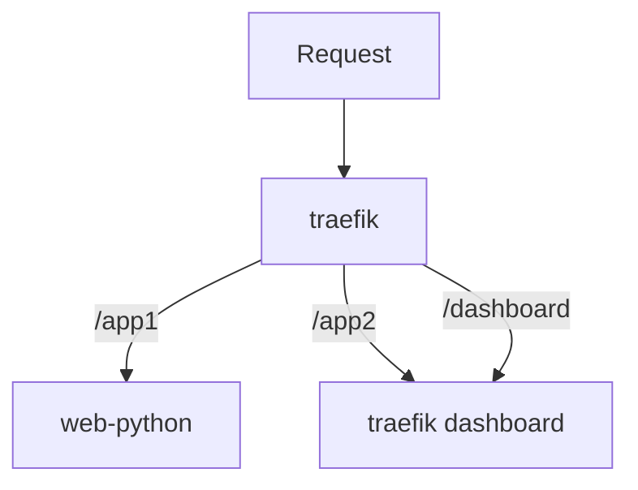

# API Gateway Lab

This repo contains a number of helm charts to experiment with kubernetes API
Gateway and Ingress approaches.

Each of the charts deploy two web servers which are routed to based on match
rules in the gateway configuration.

## Setup

Install [Docker](https://docs.docker.com/get-docker/) and
[kind](https://kind.sigs.k8s.io/) in order to run a local kubernetes cluster.

Once you've installed kind run the following command to start a new local
cluster.

```bash
make cluster
```

To install one of the charts run one of the following.

```bash
# installs the traefik-basic chart
make traefik-basic
# installs the traefik-ingressroute chart
make traefik-ingressroute
```

To uninstall the currently installed charts use the following.

```bash
make uninstall
```

For any other needs the `helm` and/or `kubectl` commands can be used directly.

## traefik

https://doc.traefik.io/traefik/



### traefik-basic

https://doc.traefik.io/traefik/routing/providers/kubernetes-ingress/

### traefik-ingressroute

https://doc.traefik.io/traefik/routing/providers/kubernetes-crd/

## istio

https://istio.io/latest/

### istio-gateway

https://istiobyexample.dev/ingress/
